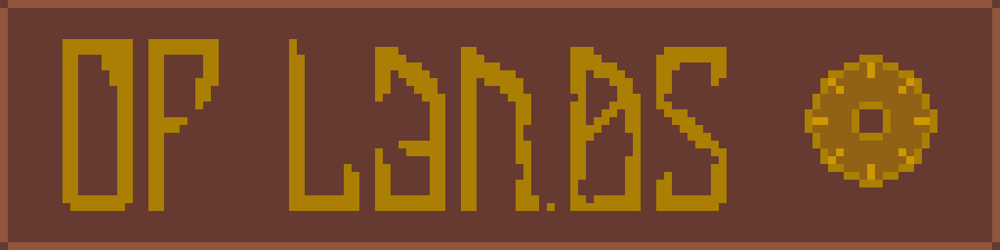

# Of Lands
**Of Lands** is a simple economy/survival strategy game.  
Based on the premise of local material conditions shaping your kingdom, it dictates
the game's focus on fulfilling needs of different areas through interactions between
settlements and constructing transport pipelines. It can be seen as somewhat of a mixture
of Transport Tycoon Deluxe, Civilisation, Dwarf Fortress and more typical city builders.

Written in Nim language with support of Nico framework, Of Lands is planned to support
limited moddability.

### Tiled mapmaking
Of Lands supports [Tiled](https://www.mapeditor.org/) as a more friendly way to create .olm
map files. Export plugin can be found in `maps` folder, and further guide on how to use
it can be found in [this file](maps/tiled.md).

### State of development
The game is currently in early development. The most up-to-date conceptual doc can be read
[here](https://docs.google.com/document/d/1FD33UzhFKeICeBnJuPv3ExzfOolEXmpZvazKdljmc9c/).

You can also see [changelog](changelog.md) depicting history of game's versions and features
added by each.